# Recipe App API

## Assets Directory

```
|  
└───Screenshots_Recording
```

## ScreenRecording

## <a href="https://github.com/Praveen101997/Recipe-Django-App/raw/main/Screenshots_Recording/Recording_Demo/screenrecording.wmv" download>Click to Download</a>

## ScrrenShots

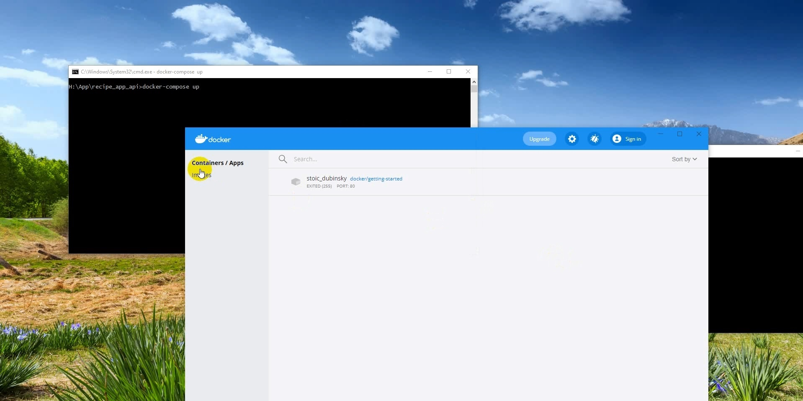
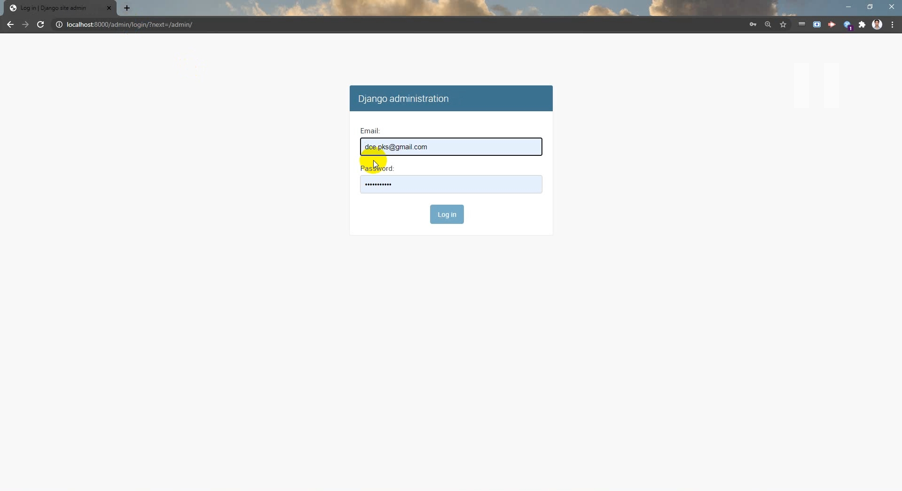
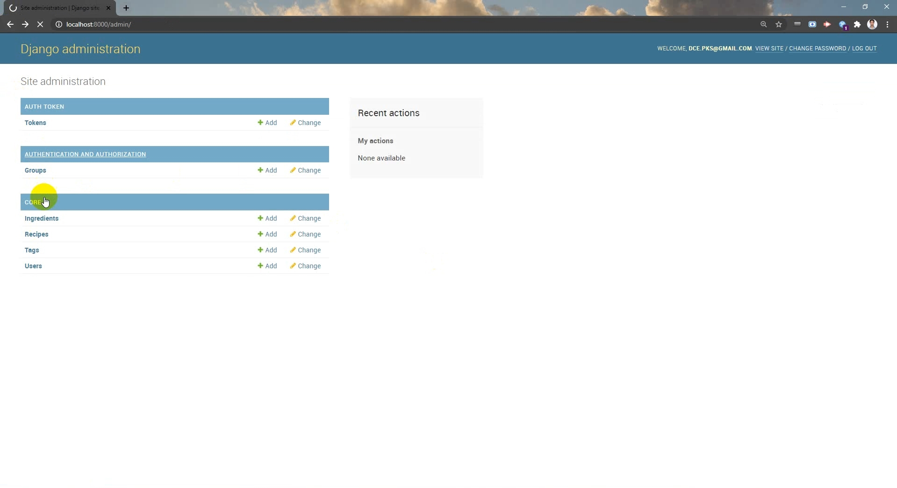
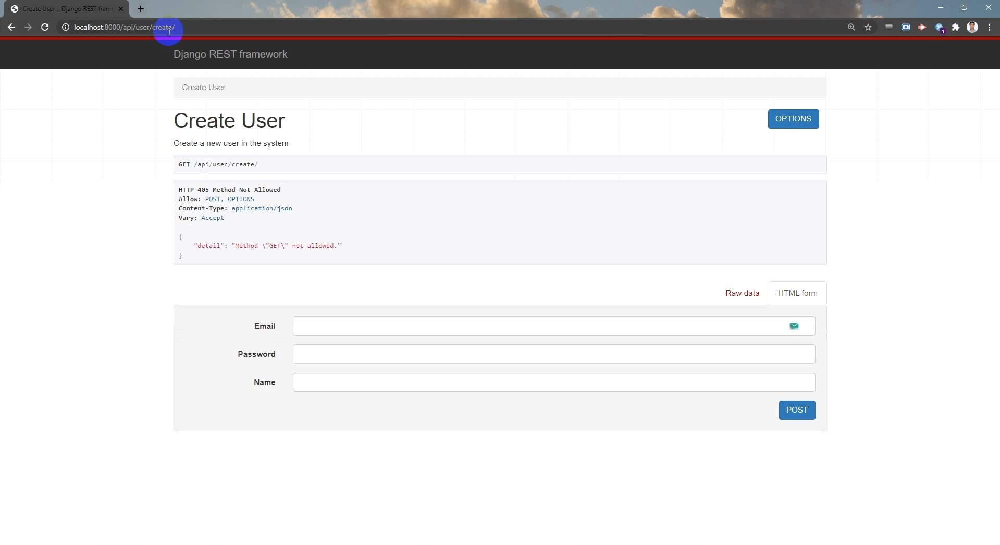
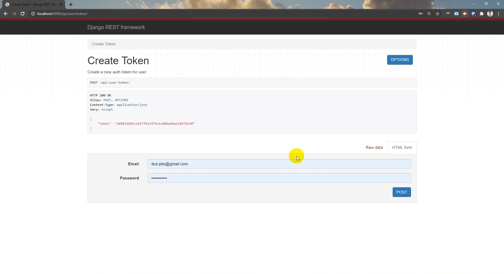
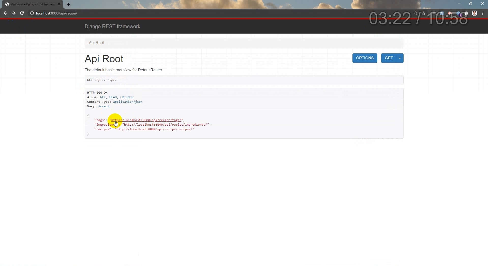

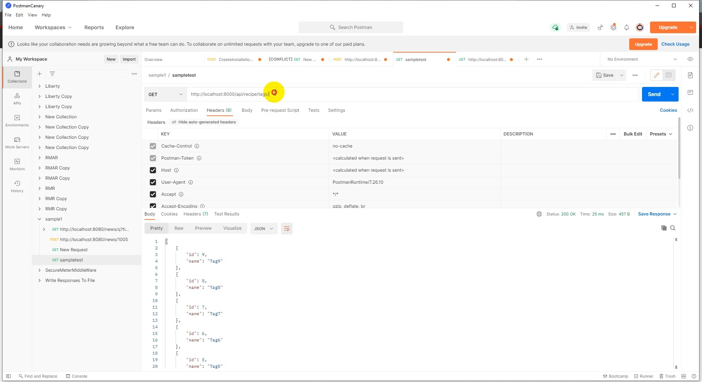
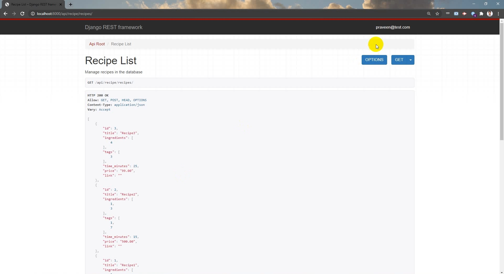
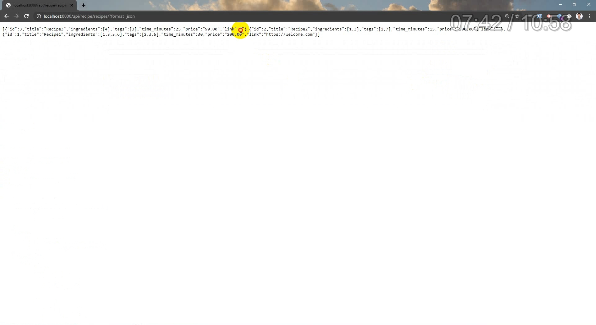
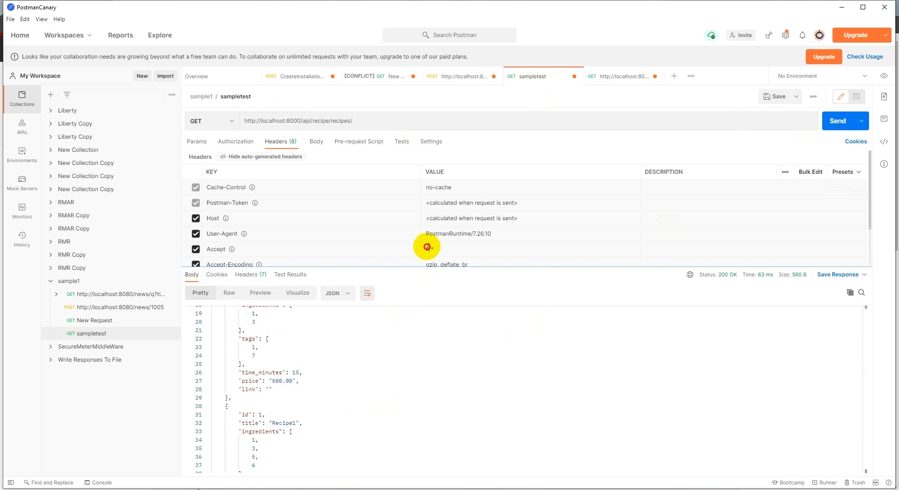
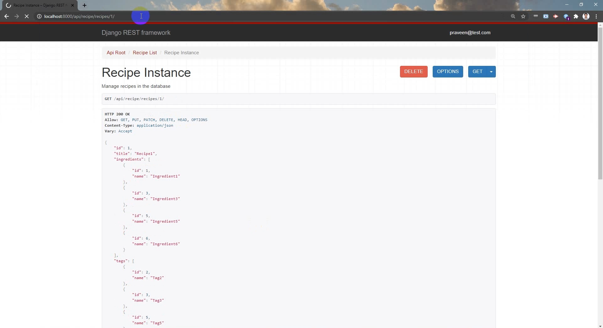
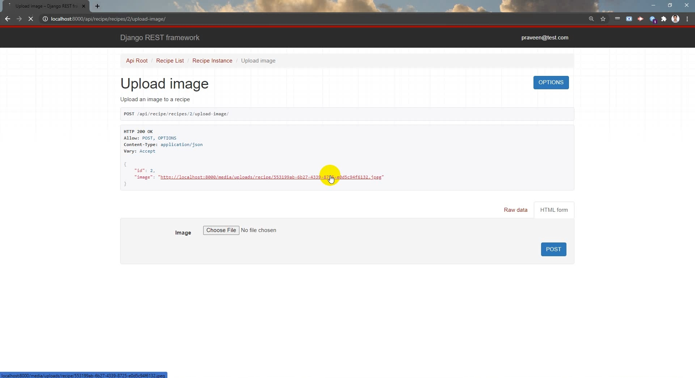
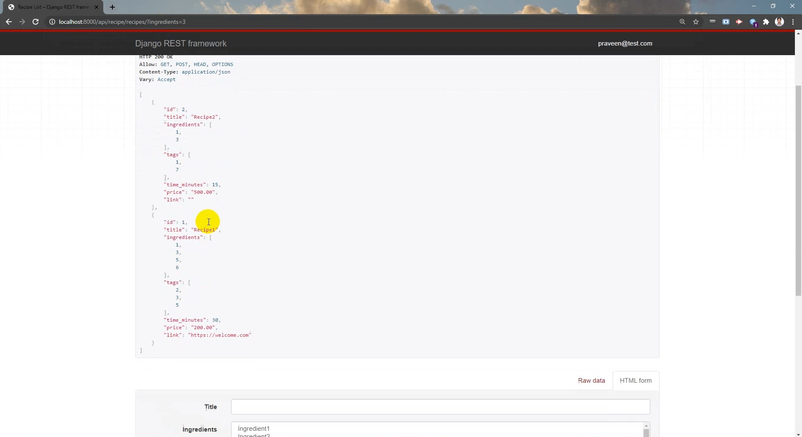
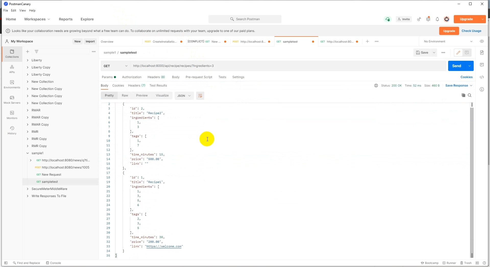
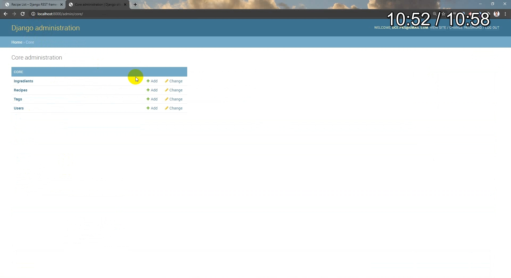


Build a fully functioning REST API using:

 - Python
 - Django / Django-REST-Framework
 - Docker / Docker-Compose
 - Test Driven Development

## Getting started

To start project, run:

```
docker-compose up
```

The API will then be available at http://127.0.0.1:8000
